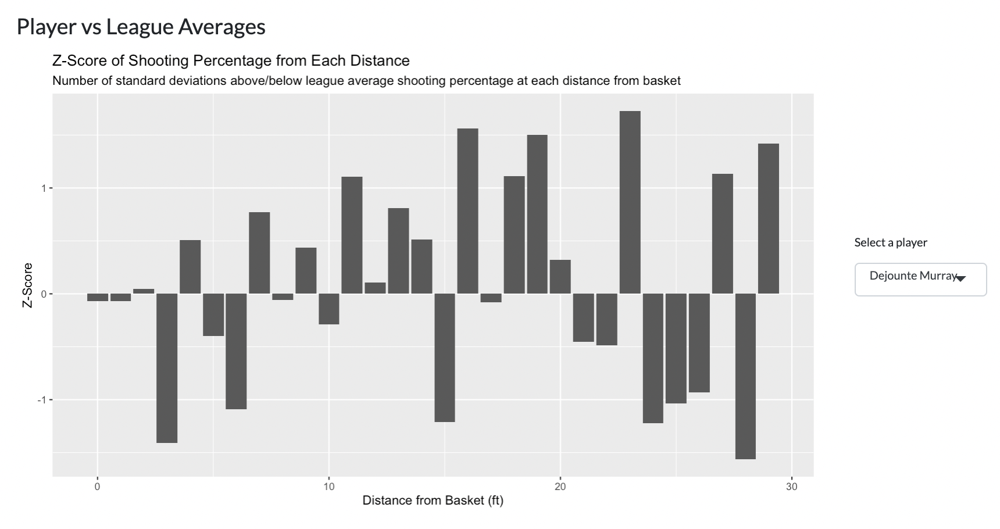
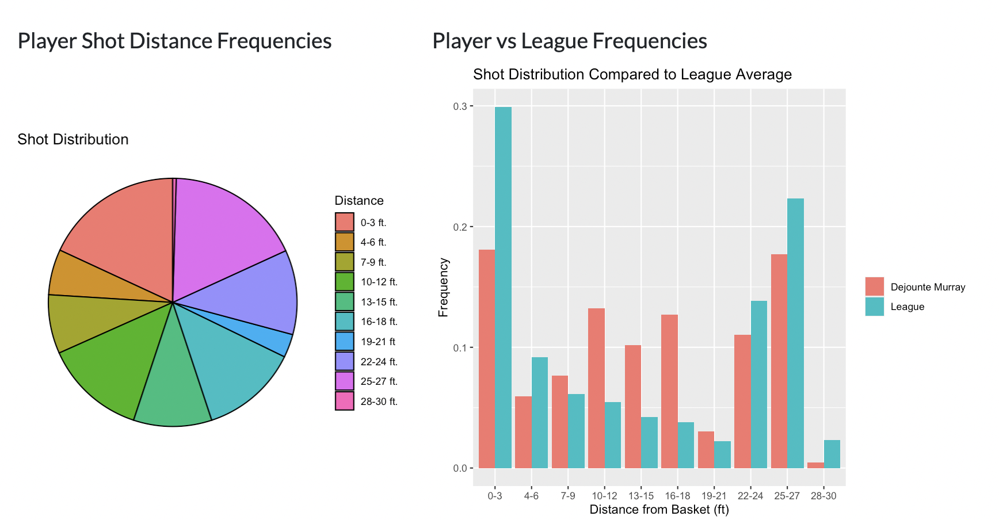

# NBA Shot Analysis

This Shiny app analyzes NBA shot data, allowing users to compare a player's shooting against league averages.

## Features

- **Player vs League Averages**: Compare individual player shooting performance against league averages.
- **Player Distance Frequencies**: Visualize the distribution of a player's shots by distance from the basket.
- **Player vs League Frequencies**: Compare the distribution of shots taken by a player against the league's shot distribution.

## Prerequisites

- R (version 4.0 or higher)
- RStudio (recommended)
- The following R packages:
  - shiny
  - bslib
  - dplyr
  - ggplot2
  - tidyr

## Installation

1. **Clone the repository**:
    ```sh
    git clone https://github.com/jc8352/nba-shot-analysis.git
    cd nba-shot-analysis
    ```

2. **Install required packages**:
    Open R or RStudio and run the following command to install the required packages:
    ```r
    install.packages(c("shiny", "bslib", "dplyr", "ggplot2", "tidyr"))
    ```

3. **Prepare the data**:
    Ensure that the data file `shotdetail_2022.csv` is located in the `data` directory within the project folder.

## Usage

1. **Run the Shiny app**:
    Open the `app.R` file in RStudio or another R environment and run the app using the following command:
    ```r
    shiny::runApp('app.R')
    ```

2. **Interact with the app**:
    - Select a player from the dropdown menu to visualize their shooting performance.
    - View the "Player vs League Averages" plot to compare the selected player's shooting performance against league averages.
    - View the "Player Distance Frequencies" plot to see the distribution of the selected player's shots by distance.
    - View the "Player vs League Frequencies" plot to compare the distribution of shots taken by the selected player against the league's shot distribution.

## Deployed App

You can also access the app online at [NBA Shot Analysis](https://jc8352.shinyapps.io/nba_shot_analysis/).

## Screenshots

### Player vs League Averages


### Player Shot Distance Frequencies and Player vs League Frequencies



## Files

- `app.R`: Main application file that sets up the Shiny UI and server.
- `nba_shots.R`: Contains functions for data processing and visualization.
- `data/shotdetail_2022.csv`: The dataset containing shot details for the 2022-23 NBA season.